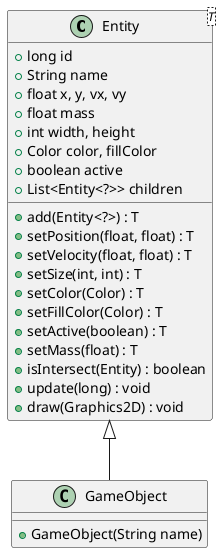
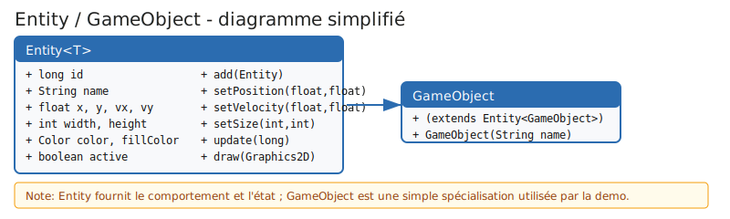

# Classe Entity et GameObject

Cette page documente l'implémentation des classes `Entity` et `GameObject` présentes dans `App.java` (package `com.snapgames.demo.oneoone`). Elle explique la conception, les champs importants, les méthodes principales, des exemples d'utilisation simples dans la démo, ainsi qu'un diagramme PlantUML et une illustration SVG.

## Résumé

`Entity<T>` est une classe générique qui représente un objet de jeu possédant un état (position, vitesse, taille, couleurs, état actif) et des comportements minimaux (mise à jour physique et rendu). `GameObject` est une spécialisation triviale qui étend `Entity<GameObject>` et sert à instancier des entités concrètes dans la démo.

Ces classes sont utilisées dans la démo pour :

- représenter le joueur (`player`) et des objets « box_x » ;
- stocker et mettre à jour la position et la vélocité ;
- dessiner les objets via `draw(Graphics2D)` ;
- activer/désactiver des entités via le champ `active`.

## Diagramme (PlantUML)

Le diagramme suivant montre la relation d'héritage et les membres principaux.



> Note: pour générer l'image depuis PlantUML, collez le bloc ci-dessus dans un outil PlantUML (ou utilisez une extension compatible dans votre éditeur).

## Illustration SVG

Une illustration simplifiée est fournie dans `src/docs/illustrations/entity-diagram.svg`.



## Champs clés

- `id` (long) : identifiant unique incrémenté pour chaque instance.
- `name` (String) : nom de l'entité, utilisé dans la démo pour retrouver des entités via `entitiesMap`.
- `x, y` (float) : position en pixels.
- `vx, vy` (float) : vélocité (pixels / seconde).
- `width, height` (int) : dimensions du rectangle dessiné.
- `color, fillColor` (Color) : couleurs pour le contour et le remplissage.
- `active` (boolean) : indique si l'entité est mise à jour et dessinée.
- `children` (List<Entity<?>>) : liste d'enfants (relation composition simple).

## Méthodes importantes

- constructeurs : `Entity()` et `Entity(String name)` ; `GameObject(String name)` appelle le constructeur d'`Entity`.
- accesseurs chainés : `setPosition`, `setVelocity`, `setSize`, `setColor`, `setFillColor`, `setActive`, `setMass` — toutes retournent l'instance pour permettre l'enchaînement.
- `add(Entity<?>)` : ajoute un enfant à la liste `children`.
- `isIntersect(Entity)` : test d'intersection simplifié (AABB approximatif). Attention : l'implémentation actuelle comporte une erreur logique (voir section « points à surveiller »).
- `update(long elapsed)` : met à jour la position en appliquant la vélocité : x += vx * (elapsed / 1000f).
- `draw(Graphics2D g)` : dessine un rectangle rempli (si `fillColor` non null) et le contour.

## Exemple d'utilisation dans la demo

Dans `App.createScene()` la demo instancie un joueur et plusieurs cases :

```java
add(new GameObject("player")
		.setSize(24, 32)
		.setPosition(window.getWidth() * 0.5f, window.getHeight() * 0.5f)
		.setColor(Color.WHITE)
		.setFillColor(Color.BLUE));

Random rand = new Random(1234);
for (int i = 0; i < 200; i++) {
		add(new GameObject("box_%s".formatted(i))
				.setPosition(rand.nextFloat(((int) (window.getWidth() - 8) / 8) * 8f),
										 rand.nextFloat(((int) (window.getHeight() - 8) / 8) * 8f))
				.setSize(8, 8)
				.setColor(Color.BLACK)
				.setFillColor(Colors.random()));
}
```

Ensuite, dans la boucle de mise à jour (`update`) :

- `managePlayerInput()` lit l'état des touches et fixe `vx`/`vy` du joueur ;
- `manageBoxesAnimation()` met à jour aléatoirement les vitesses des boîtes périodiquement ;
- `entities.stream().filter(Entity::isActive).forEach(e -> updateEntity(e, elapsed));` appelle `update` sur chaque entité active.

Le rendu appelle `draw(Graphics2D)` pour chaque entité active.


## Cas limites et remarques

- isIntersect : la méthode a été corrigée pour utiliser un test AABB (Axis-Aligned Bounding Box) correct. L'implémentation précédente était susceptible de produire des résultats incorrects. La version maintenant en place est :

```java
public boolean isIntersect(Entity<?> other) {
    // Axis-Aligned Bounding Box (AABB) intersection test
    return x < other.x + other.width
            && x + width > other.x
            && y < other.y + other.height
            && y + height > other.y;
}
```

Cette implémentation compare correctement les positions et tailles des deux rectangles.

- Synchronisation : `entities` est une `CopyOnWriteArrayList` dans `App`, ce qui évite certaines conditions de concurrence lors de l'itération ; `children` dans `Entity` est une simple `ArrayList` — si vous modifiez `children` depuis plusieurs threads, pensez à utiliser une collection thread-safe.
- Types génériques : `Entity<T>` retourne `T` pour les chaines d'appels ; `GameObject` déclare `extends Entity<GameObject>` afin d'activer ce style.
- Performances : les allocations d'objets en grand nombre (200 boxes) sont raisonnables pour une démo. Pour de plus gros jeux, envisager le pooling d'objets.

## Exemples de tests rapides

- Créer une instance, vérifier update() :

```java
Entity<?> e = new Entity<>();
e.setPosition(0,0).setVelocity(100,0);
e.update(1000);
// attendu : e.x ≈ 100
```

- Tester isIntersect après correction :

```java
Entity<?> a = new Entity<>(); a.setPosition(0,0).setSize(10,10);
Entity<?> b = new Entity<>(); b.setPosition(5,5).setSize(10,10);
assert a.isIntersect(b);
```

## Conclusion

`Entity` est une abstraction légère et pragmatique adaptée aux besoins d'une petite démo 2D. `GameObject` fournit une spécialisation simple pour instancier des objets de jeu. Les méthodes enchaînables rendent la construction des entités concise dans le code de la démo.

Si vous le souhaitez, je peux :

- corriger la méthode `isIntersect` dans `App.java` et ajouter un test unitaire ;
- générer une image PNG depuis le PlantUML et l'inclure dans la doc ;
- détailler un guide sur le pooling d'objets pour améliorer les performances.

